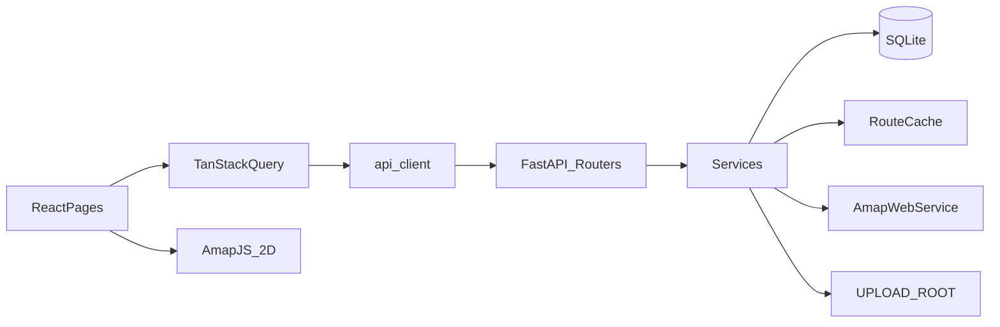

# 个人旅游日程规划器最终实施方案

> 本文档为编码阶段唯一实施依据。与旧稿冲突处以本文为准。  
> 结论：**核心技术决策已定，可按阶段进入实施。**

---

## 1. 项目目标与范围

### 1.1 目标

个人自用的旅游日程规划工具：按旅行与日期编排活动，搜索并保存地点，在 2D 地图上展示，通过后端代理计算公交/地铁/步行路线，将交通段插入时间轴，并上传行程相关资料、导出 Markdown。

### 1.2 技术选型（已定）

| 层 | 技术 |
|---|---|
| 前端 | React + TypeScript + Vite |
| 服务端状态 | TanStack Query |
| 后端 | FastAPI + Python |
| ORM | SQLAlchemy 2.x |
| 迁移 | Alembic |
| 数据库 | 开发 SQLite，结构兼容 PostgreSQL |
| 地图 | 高德 JS API 2.0，仅 2D |
| 搜索/路线 | 高德 Web 服务 API，仅后端调用 |
| 文件 | 本地 `uploads/` |
| 测试 | pytest、FastAPI TestClient、Vitest、React Testing Library |

### 1.3 明确不实现

爬虫、AI 自动排程、实时定位、导航、3D 地图、实时路况、多人协作、权限系统、云对象存储、生产级分布式缓存。

---

## 2. 已确认的技术决策

1. 普通事项时间区间为半开区间 `[start_time, end_time)`。
2. 全天事项：`is_all_day=true`，`start_time`/`end_time` 均为 `null`；独立全天区展示；不参与普通时间冲突。
3. MVP 禁止单个事项跨午夜；`end_time > start_time`；跨午夜活动由用户拆成两天；自动交通若跨午夜返回业务错误，不写入次日。
4. Item 双字段：`kind` ∈ `{activity, transport}`；`category` ∈ `{place, meal, hotel, rest, custom}` 或 `null`（仅 transport）。
5. 无循环外键：仅 `RouteSegment.transport_item_id → ItineraryItem.id`（UNIQUE，ON DELETE CASCADE）。
6. `RouteCache` 与 `RouteSegment` 职责分离；缓存字段不落在 Segment 上。
7. RouteSegment 保存起终点名称与坐标快照；Place 外键 `ON DELETE SET NULL`。
8. Place 被 Item 引用时删除返回 `409 PLACE_IN_USE`。
9. SQL 类型：`Date` / `Time` / timezone-aware `DateTime`(UTC)；墙钟日期时间不转 UTC；`Trip.timezone` 默认 `Asia/Shanghai`；金额 `estimated_cost_cents` 整数。
10. 公交 MVP：单城市、`city1=city2=Trip.city_code`、`AlternativeRoute=1`、默认 `strategy=7`、显式请求 `cost/navi/polyline`。
11. 路线 API 区分 preview 与 persist。
12. 路径由 Settings 固定绝对路径，不依赖 CWD。
13. 无登录鉴权；`SECRET_KEY` 仅预留。
14. 上传 10MB；扩展名 + MIME + 文件头校验；XHR/Axios 进度。
15. JSON API 统一信封；下载与 Markdown 导出直接返回文件流。

---

## 3. 系统架构

```text
web (React + TS + Vite + TanStack Query)
  pages → features → api client → FastAPI
  lib/amap → 高德 JS API 2.0（仅 Key + securityJsCode）
        │
server (FastAPI)
  api routers → services → models / amap_* / upload
        ├── SQLite (Alembic)
        ├── uploads/ (绝对路径)
        └── 高德 Web 服务（AMAP_WEB_SERVICE_KEY）
```



---

## 4. 目录结构

```text
旅游计划/
├── README.md
├── .gitignore
├── PRODUCT.md
├── DESIGN.md
├── web/
│   ├── package.json
│   ├── vite.config.ts
│   ├── index.html
│   ├── .env.example
│   ├── .env.local              # 不提交
│   └── src/
│       ├── main.tsx
│       ├── App.tsx
│       ├── api/                # client、trips、items、places、routes、attachments、exports
│       ├── components/
│       ├── features/           # trips、itinerary、places、routes、attachments
│       ├── hooks/
│       ├── layouts/            # DesktopShell、MobileShell
│       ├── lib/amap/
│       │   ├── loader.ts
│       │   ├── types.ts
│       │   ├── map-manager.ts
│       │   ├── marker-manager.ts
│       │   ├── polyline-manager.ts
│       │   └── errors.ts
│       ├── pages/              # TripListPage、TripPlannerPage
│       ├── styles/             # tokens.css、global.css
│       ├── types/              # 与后端 DTO 镜像
│       └── utils/              # timeConflict.ts 等
├── server/
│   ├── requirements.txt
│   ├── alembic.ini
│   ├── alembic/versions/
│   ├── .env.example
│   ├── .env                    # 不提交
│   └── app/
│       ├── main.py
│       ├── api/                # trips、items、places、routes、attachments、exports、health
│       ├── core/               # config、errors、logging、paths
│       ├── db/                 # base、session
│       ├── models/
│       ├── schemas/
│       ├── services/           # trip、item、place、amap_places、amap_routes、route_cache、auto_transport、upload、export、usage
│       └── utils/              # time_conflict、cache_key、files
├── tests/
│   ├── conftest.py
│   ├── unit/
│   ├── api/
│   └── fixtures/amap/          # 抽象 fixture，非真实 Key 响应泄密
└── uploads/                    # .gitkeep；内容不提交
```

**唯一支持的后端启动方式（README 强制）：**

```bash
cd server
uvicorn app.main:app --reload --port 8000
```

`PROJECT_ROOT`、`SERVER_ROOT`、`UPLOAD_ROOT`、`DATABASE_PATH` 均相对 `server/app/core/paths.py` 用 `Path(__file__).resolve()` 推导，不依赖 CWD。

---

## 5. 环境变量与安全边界

### 5.1 `web/.env.local`

```bash
VITE_AMAP_JS_KEY=
VITE_AMAP_SECURITY_CODE=
VITE_API_BASE_URL=http://localhost:8000
```

### 5.2 `server/.env`

```bash
AMAP_WEB_SERVICE_KEY=
SECRET_KEY=
DATABASE_URL=sqlite:///{DATABASE_PATH}   # Settings 写入绝对路径；example 可写占位说明
UPLOAD_DIR=uploads                       # 相对 PROJECT_ROOT，启动时 resolve 为 UPLOAD_ROOT
CORS_ORIGINS=http://localhost:5173
```

### 5.3 安全边界

- `AMAP_WEB_SERVICE_KEY` 禁止进入任何 `VITE_` 变量或前端包。
- `.env` / `.env.local` 不提交；仅提交 `.env.example`（空值）。
- 日志对 Key 脱敏（最多保留前后 2 字符）。
- 本地可在 `AMapLoader.load` 前设置 `window._AMapSecurityConfig.securityJsCode`。
- 公网部署：明文 `securityJsCode` 仅适合本地/受控环境；生产使用高德安全密钥代理；Web 服务 Key 永不进浏览器。
- CORS 仅允许配置的前端源。

---

## 6. 时间与时区策略

| 概念 | 规则 |
|---|---|
| `created_at` / `updated_at` | timezone-aware DateTime，存 UTC |
| `Trip.timezone` | IANA 字符串，默认 `Asia/Shanghai`；供前端展示元数据时间 |
| `Trip.start_date` / `end_date` | SQL `Date`，旅行当地日历日 |
| `ItineraryItem.date` | SQL `Date`，当地日历日 |
| `start_time` / `end_time` | SQL `Time` 或 `null`；当地墙上时间，**不**换算 UTC |
| 普通事项 | `[start_time, end_time)`，且 `end_time > start_time` |
| 全天 | `is_all_day=true`，时间为 `null` |
| 跨午夜 | 拒绝 |

API JSON 中日期用 `YYYY-MM-DD`，时间用 `HH:MM` 或 `HH:MM:SS`（统一 `HH:MM`）。

---

## 7. 数据模型

主键一律 `String(36)` UUID。下列为权威字段集。

### 7.1 Trip

| 字段 | SQL | 可空 | 默认 | 说明 |
|---|---|---|---|---|
| id | String(36) | N | uuid4 | PK |
| name | String(120) | N | | |
| city_name | String(80) | N | | |
| city_code | String(16) | N | | 公交 city1/city2 |
| timezone | String(64) | N | `Asia/Shanghai` | |
| start_date | Date | N | | |
| end_date | Date | N | | `>= start_date` |
| notes | Text | Y | null | |
| created_at | DateTime(tz) | N | utcnow | |
| updated_at | DateTime(tz) | N | utcnow | |

索引：`city_code`；`start_date`。  
Schema：`TripCreate` / `TripUpdate` / `TripRead`。

缩短日期若存在越界 Item → `409 TRIP_DATE_RANGE_HAS_ITEMS`。

### 7.2 Place

| 字段 | SQL | 可空 | 默认 |
|---|---|---|---|
| id | String(36) | N | uuid4 |
| trip_id | String(36) FK→trips | N | CASCADE |
| amap_poi_id | String(64) | Y | null |
| name | String(200) | N | |
| address | String(500) | Y | null |
| city_name | String(80) | Y | null |
| city_code | String(16) | Y | null |
| district | String(80) | Y | null |
| lng | Float | N | GCJ-02 |
| lat | Float | N | GCJ-02 |
| created_at / updated_at | DateTime(tz) | N | |

唯一：`UNIQUE(trip_id, amap_poi_id)`（SQLite 上多个 NULL 的 `amap_poi_id` 互不冲突，允许手动地点）。  
索引：`(trip_id)`。  
Schema：`PlaceCreate` / `PlaceUpdate` / `PlaceRead` / `PlaceSearchHit`。

### 7.3 ItineraryItem

| 字段 | SQL | 可空 | 默认 |
|---|---|---|---|
| id | String(36) | N | |
| trip_id | FK trips | N | CASCADE |
| date | Date | N | |
| start_time | Time | Y | null |
| end_time | Time | Y | null |
| is_all_day | Boolean | N | false |
| kind | String(16) | N | `activity` \| `transport` |
| category | String(16) | Y | activity 必填；transport 必须 null |
| title | String(200) | N | |
| description | Text | Y | null |
| place_id | FK places | Y | SET NULL |
| estimated_cost_cents | Integer | Y | null |
| sort_order | Integer | N | 0 |
| created_at / updated_at | DateTime(tz) | N | |

索引：`(trip_id, date)`；`(trip_id, date, start_time)`。  
Schema：`ItemCreate` / `ItemUpdate` / `ItemRead`。

服务层/CheckConstraint：

- `is_all_day` ⇒ 时间皆 null；非全天 ⇒ 时间皆非 null 且 `end > start`
- `kind=activity` ⇒ `category IS NOT NULL`
- `kind=transport` ⇒ `category IS NULL`；用户 API 禁止把 transport 改成 activity（或反向）除非走路线模块专用接口

### 7.4 RouteSegment

| 字段 | SQL | 可空 | 说明 |
|---|---|---|---|
| id | String(36) | N | PK |
| trip_id | FK | N | CASCADE |
| transport_item_id | FK items | N | **UNIQUE**，CASCADE |
| after_item_id | FK items | N | RESTRICT/NO ACTION |
| before_item_id | FK items | N | RESTRICT/NO ACTION |
| origin_place_id | FK places | Y | SET NULL |
| destination_place_id | FK places | Y | SET NULL |
| origin_name | String(200) | N | 快照 |
| origin_lng / origin_lat | Float | N | 快照 |
| destination_name | String(200) | N | |
| destination_lng / destination_lat | Float | N | |
| route_type | String(16) | N | `transit` \| `walking` |
| strategy | Integer | Y | transit 用；walking 可 null |
| duration_seconds | Integer | N | |
| distance_meters | Integer | Y | |
| walking_distance_meters | Integer | Y | |
| transfer_count | Integer | Y | |
| polyline_json | JSON | Y | `[[lng,lat],...]` |
| steps_json | JSON | Y | 标准化步骤 |
| provider | String(16) | N | `amap` |
| provider_response_version | String(16) | N | `v5` |
| created_at / updated_at | DateTime(tz) | N | |

唯一：`UNIQUE(trip_id, after_item_id, before_item_id, route_type, strategy)`。  
服务层校验：三个 Item 与 Segment 同属一 Trip；after/before 为 `kind=activity`；transport 为 `kind=transport`。  
**不含** `cache_key` / `expires_at`。

Schema：`RouteSegmentRead` / `RouteSegmentCreate`（persist 体）/ `RouteSegmentUpdate`。

### 7.5 RouteCache

| 字段 | SQL | 可空 | 说明 |
|---|---|---|---|
| id | String(36) | N | |
| cache_key | String(64) | N | SHA-256 hex，**UNIQUE** |
| origin_lng / origin_lat | Float | N | 六位小数语义 |
| destination_lng / destination_lat | Float | N | |
| city1 / city2 | String(16) | Y | walking 可空 |
| route_type | String(16) | N | |
| strategy | Integer | Y | |
| nightflag | Integer | N | 0/1 |
| date | Date | N | |
| time_bucket | String(2) | N | `00`/`06`/`09`/`12`/`17`/`20` |
| provider | String(16) | N | `amap` |
| provider_response_version | String(16) | N | `v5` |
| normalized_response_json | JSON | N | RouteDTO |
| created_at | DateTime(tz) | N | |
| expires_at | DateTime(tz) | N | |
| last_hit_at | DateTime(tz) | Y | |
| hit_count | Integer | N | 0 |

Schema：内部使用，不直接对前端暴露表结构。

### 7.6 Attachment

| 字段 | SQL | 可空 |
|---|---|---|
| id | String(36) | N |
| trip_id | FK CASCADE | N |
| item_id | FK SET NULL | Y |
| original_name | String(255) | N |
| stored_name | String(255) | N |
| relative_path | String(500) | N |
| mime_type | String(100) | N |
| file_extension | String(16) | N |
| size_bytes | Integer | N |
| sha256 | String(64) | N |
| created_at | DateTime(tz) | N |

校验：若有 `item_id`，Item.trip_id 必须等于 Attachment.trip_id。  
Schema：`AttachmentRead`。

### 7.7 AmapUsageLog

| 字段 | SQL | 可空 |
|---|---|---|
| id | String(36) | N |
| service_type | String(32) | N | `place_search`/`transit`/`walking` |
| endpoint | String(200) | N |
| request_status | String(16) | N | `ok`/`error`/`timeout` |
| amap_info_code | String(32) | Y |
| cache_hit | Boolean | N | default false |
| duration_ms | Integer | Y |
| created_at | DateTime(tz) | N |

不存 Key、不存完整原始响应。

---

## 8. 数据库约束与级联规则

| 场景 | 行为 |
|---|---|
| 删除 Trip | CASCADE：Place、Item、RouteSegment、Attachment；Attachment 同步删文件 |
| 删除 Place | 若存在 Item.place_id 引用 → `409 PLACE_IN_USE`；无引用则删；Segment 上 place FK SET NULL，快照保留 |
| 删除 activity Item | 作为 after/before 的 Segment：先删 Segment（CASCADE transport Item） |
| 删除 transport Item | CASCADE 删对应 RouteSegment（因 transport_item_id ON DELETE CASCADE）；避免孤儿 Segment |
| 删除 RouteSegment | 同步删除其 transport Item（事务内显式删除 Item，或依赖应用层双向清理；**以服务层事务保证无孤儿**） |
| Item.place_id | ON DELETE SET NULL |
| Attachment.item_id | ON DELETE SET NULL |

缩短 Trip 日期：有越界 Item → `409 TRIP_DATE_RANGE_HAS_ITEMS`，不静默删改。

---

## 9. API 与 DTO

### 9.1 响应信封

JSON 接口：

```json
{ "data": {}, "error": null }
```

```json
{
  "data": null,
  "error": {
    "code": "TRANSPORT_TIME_CONFLICT",
    "message": "交通时间超过两个活动之间的可用时间",
    "details": {
      "requiredDurationSeconds": 2400,
      "availableDurationSeconds": 1800
    }
  }
}
```

**不使用信封：**

- `GET /api/attachments/{id}/download` → 文件流
- `GET /api/exports/trips/{tripId}/markdown` → `Content-Type: text/markdown; charset=utf-8`

### 9.2 RouteDTO（标准化，前后端唯一路线形状）

```json
{
  "routeType": "transit",
  "strategy": 7,
  "durationSeconds": 2400,
  "distanceMeters": 15300,
  "walkingDistanceMeters": 820,
  "transferCount": 2,
  "polyline": [[108.9398, 34.3416], [108.9451, 34.3372]],
  "steps": [],
  "provider": "amap",
  "providerResponseVersion": "v5"
}
```

### 9.3 接口表

#### Trips

| 方法 | 路径 | 请求 | 成功 | 错误 | 幂等 | 事务 |
|---|---|---|---|---|---|---|
| POST | `/api/trips` | TripCreate | 201 TripRead | 422 | 否 | 单写 |
| GET | `/api/trips` | — | 200 TripRead[] | — | 是 | 读 |
| GET | `/api/trips/{tripId}` | — | 200 TripRead | 404 | 是 | 读 |
| PATCH | `/api/trips/{tripId}` | TripUpdate | 200 TripRead | 404/422/409 TRIP_DATE_RANGE_HAS_ITEMS | 是 | 单写 |
| DELETE | `/api/trips/{tripId}` | — | 200 `{ok:true}` | 404 | 是 | 级联+删文件 |

#### Items

| 方法 | 路径 | 请求 | 成功 | 错误 | 幂等 | 事务 |
|---|---|---|---|---|---|---|
| GET | `/api/trips/{tripId}/items` | `?date=` | 200 ItemRead[] | 404 | 是 | 读 |
| POST | `/api/trips/{tripId}/items` | ItemCreate（仅 activity） | 201 ItemRead + 可选 warnings | 422 跨午夜/校验；日期越界 | 否 | 单写 |
| PATCH | `/api/items/{itemId}` | ItemUpdate | 200 ItemRead | 404/422；transport 禁止改 kind | 是 | 写；时间变更触发交通失效清理 |
| DELETE | `/api/items/{itemId}` | — | 200 | 404 | 是 | 清关联 Segment+transport |
| POST | `/api/trips/{tripId}/items/reorder` | `{date, orderedIds}` | 200 ItemRead[] | 422 | 是 | 批量更新 sort_order |

冲突：普通活动重叠时 **仍 201/200 保存**，`data.warnings` 含冲突码（与交通 persist 的硬冲突区分）。

#### Places

| 方法 | 路径 | 请求 | 成功 | 错误 | 幂等 |
|---|---|---|---|---|---|
| GET | `/api/places/search` | `q, cityCode?`（默认 Trip 需 tripId 查询参数）`tripId` | 200 PlaceSearchHit[] | 400/502 | 是 |
| GET | `/api/trips/{tripId}/places` | — | 200 PlaceRead[] | 404 | 是 |
| POST | `/api/trips/{tripId}/places` | PlaceCreate | 201 PlaceRead | 422；同 amap_poi_id 返回已有 | 条件幂等 |
| PATCH | `/api/places/{placeId}` | PlaceUpdate | 200 | 404 | 是 |
| DELETE | `/api/places/{placeId}` | — | 200 | 404/409 PLACE_IN_USE | 是 |

#### Routes

| 方法 | 路径 | 请求体要点 | 成功 | 错误 | 幂等 | 事务 |
|---|---|---|---|---|---|---|
| POST | `/api/routes/transit/preview` | origin/destination placeIds 或坐标、date、time、strategy?、tripId | 200 `{route: RouteDTO, cacheHit}` | 城市类错误/502/AMAP_NO_ROUTE | 缓存级 | 可读写作 Cache |
| POST | `/api/routes/walking/preview` | 同上无 strategy | 200 同上 | 502 等 | 缓存级 | 同 |
| POST | `/api/routes/segments` | tripId, afterItemId, beforeItemId, routeType, strategy?, route?:RouteDTO | 201/200 Segment+Item | 409 TRANSPORT_TIME_CONFLICT；跨午夜；缺 Place | **是** upsert | **单事务**写 Segment+Item |
| PATCH | `/api/routes/segments/{id}` | strategy 等触发重算或更新快照 | 200 | 404/409 | 是 | 事务 |
| DELETE | `/api/routes/segments/{id}` | — | 200 | 404 | 是 | 删 Segment+transport Item |

Preview：**不**创建 Item/Segment。Persist：保证幂等与事务。

#### Attachments

| 方法 | 路径 | 请求 | 成功 | 错误 | 幂等 |
|---|---|---|---|---|---|
| POST | `/api/attachments` | multipart file+tripId+itemId? | 201 AttachmentRead | 400 类型/大小 | 否 |
| GET | `/api/trips/{tripId}/attachments` | — | 200[] | 404 | 是 |
| GET | `/api/attachments/{id}/download` | — | 200 文件流 | 404 | 是 |
| DELETE | `/api/attachments/{id}` | — | 200；文件删失败则 500 且不谎报成功 | 404/500 | 是 |

#### Exports

| 方法 | 路径 | 成功 | 错误 |
|---|---|---|---|
| GET | `/api/exports/trips/{tripId}/markdown` | 200 markdown 流 | 404 |

#### Health

| GET | `/api/health` | `{status:"ok"}` |

---

## 10. 统一错误码

| code | HTTP | 含义 |
|---|---|---|
| VALIDATION_ERROR | 422 | 字段校验 |
| NOT_FOUND | 404 | 资源不存在 |
| ITEM_TIME_CONFLICT | 200 内 warnings 或详情 | 普通活动时间重叠（软） |
| CROSS_MIDNIGHT_NOT_ALLOWED | 422 | 事项或交通跨午夜 |
| ITEM_DATE_OUT_OF_TRIP_RANGE | 422 | Item 日期越界 |
| TRIP_DATE_RANGE_HAS_ITEMS | 409 | 缩短旅行日期被拒 |
| PLACE_IN_USE | 409 | Place 仍被引用 |
| PLACE_TRIP_MISMATCH | 422 | Place/Item 分属不同 Trip |
| ATTACHMENT_TRIP_MISMATCH | 422 | 附件 Item 与 Trip 不一致 |
| TRANSPORT_TIME_CONFLICT | 409 | 交通时长超过空档 |
| TRANSPORT_CROSS_MIDNIGHT | 422 | 交通结束跨午夜 |
| CROSS_CITY_TRANSIT_NOT_SUPPORTED | 400 | 跨城公交 |
| TRIP_CITY_CODE_REQUIRED | 400 | 缺 city_code |
| PLACE_CITY_MISMATCH | 400 | Place 与 Trip 城市不一致 |
| AMAP_UPSTREAM_ERROR | 502 | 高德失败 |
| AMAP_NO_ROUTE | 404 | 无路线 |
| AMAP_NO_PLACE | 404 | 搜索无结果（可 200 空数组，搜索用空数组） |
| UPLOAD_INVALID_TYPE | 400 | 类型非法 |
| UPLOAD_TOO_LARGE | 400 | 超 10MB |
| UPLOAD_CONTENT_INVALID | 400 | 文件头/解码失败 |
| INTERNAL_ERROR | 500 | 未分类；含删文件失败 |

---

## 11. 时间冲突规则

### 11.1 半开区间

```text
conflict(A,B) =
  A.start_time < B.end_time
  AND
  B.start_time < A.end_time
```

仅比较：同 `trip_id`、同 `date`、`is_all_day=false`、且 `start_time/end_time` 非空的事项（含 transport）。

`09:00–10:00` 与 `10:00–11:00`：**不冲突**。

### 11.2 全天

不参与上述公式；UI 独立「全天」区域。

### 11.3 跨午夜

创建/更新时若 `end_time <= start_time` → `CROSS_MIDNIGHT_NOT_ALLOWED`。

### 11.4 双端实现

- `server/app/utils/time_conflict.py`
- `web/src/utils/timeConflict.ts`  
公式与用例必须一致；后端为持久化权威。

### 11.5 用例

| A | B | 结果 |
|---|---|---|
| 09:00–10:00 | 10:00–11:00 | 不冲突 |
| 09:00–11:00 | 10:00–12:00 | 冲突 |
| 09:00–12:00 | 10:00–11:00 | 冲突（包含） |
| 09:00–11:00 | 09:00–11:00 | 冲突 |
| 全天 vs 任意定时 | — | 不检测为冲突 |

---

## 12. 高德地点搜索

模块：`server/app/services/amap_places.py`

- 入参：keywords、city（city_code 或城市名）、分页
- 超时：connect 5s / read 10s
- 输出：`PlaceSearchHit[]`（amap_poi_id、name、address、lng、lat、city_code、district…）
- 空结果：`data: []`
- 记录 `AmapUsageLog`；Key 脱敏
- 测试：MockTransport + `tests/fixtures/amap/place_search_ok.json`（抽象字段）

前端防抖 400–600ms；每页 ≤20 条。

---

## 13. 高德路线适配

模块：`server/app/services/amap_routes.py`（参数集中于此）

### 13.1 公交

- `AlternativeRoute = 1`（仅一条）
- 默认 `strategy = 7`
- `city1 = city2 = Trip.city_code`
- 显式 show_fields：`cost`、`navi`、`polyline`（以官方路径规划 2.0 参数名为准，封装内常量定义）
- 校验：缺 city_code → `TRIP_CITY_CODE_REQUIRED`；Place city 与 Trip 不一致 → `PLACE_CITY_MISMATCH`；跨城 → `CROSS_CITY_TRANSIT_NOT_SUPPORTED`

### 13.2 步行

- 单条推荐；请求 `cost`、`navi`、`polyline`
- 不受单城市公交限制；校验坐标合法

### 13.3 适配容错

处理：超时、网络错误、HTTP 非 2xx、`status != 1`、业务码、空路线、缺 duration、缺 polyline、步骤缺字段、经纬度异常。  
单步异常跳过或填默认，**不得**拖垮进程。映射失败 → `AMAP_UPSTREAM_ERROR` / `AMAP_NO_ROUTE`。  
前端永不解析高德原始 JSON。

---

## 14. 路线缓存

模块：`server/app/services/route_cache.py` + `utils/cache_key.py`

### 14.1 Key 材料

`route_type, origin_lng/lat, dest_lng/lat, strategy, city1, city2, nightflag, date, time_bucket, provider, provider_response_version`

坐标格式化：六位小数。  
规范化字符串示例：

```text
amap:v5:transit:108.939800,34.341600:108.953200,34.327100:strategy=7:city1=029:city2=029:nightflag=0:date=2026-10-03:bucket=09
```

入库：`cache_key = sha256(规范化串)`，同时存可调试字段。

### 14.2 时间桶

| 本地时间 | bucket |
|---|---|
| 00:00–05:59 | 00 |
| 06:00–08:59 | 06 |
| 09:00–11:59 | 09 |
| 12:00–16:59 | 12 |
| 17:00–19:59 | 17 |
| 20:00–23:59 | 20 |

### 14.3 TTL 与行为

- TTL = 12 小时
- 未过期：返回缓存，`hit_count++`，`last_hit_at` 更新，`cache_hit=true`
- 过期：请求高德并覆盖
- 读缓存异常：降级打高德
- 写缓存异常：仍返回本次 RouteDTO
- **不启用**过期 stale fallback；高德失败不得用过期缓存顶替

---

## 15. 自动交通段

模块：`server/app/services/auto_transport.py`

### 15.1 可生成条件

1. 同 Trip、同日  
2. 均为 `kind=activity`  
3. 均有 Place  
4. after.end_time、before.start_time 非空  
5. `after.end_time <= before.start_time`（半开语义下空档起点对齐）  
6. 坐标合法；公交满足单城市  

### 15.2 时间

```text
transport.start_time = after.end_time
transport.end_time = start_time + duration_seconds
```

若 `transport.end_time` 跨日或 `<` 逻辑导致跨午夜 → `TRANSPORT_CROSS_MIDNIGHT`。  
若 `transport.end_time > before.start_time`：preview 仍可返回路线；**persist** → `409 TRANSPORT_TIME_CONFLICT` + details 秒数。

### 15.3 幂等

唯一键 `(trip_id, after_item_id, before_item_id, route_type, strategy)`。  
同参：更新 Segment + transport Item。  
策略变：更新同行记录，不插第二条。  
并发：捕获唯一约束后 re-read。

### 15.4 失效

Place/时间/strategy/city_code/坐标变化 → 删除或强制重算自动段。  
删 after/before → 删 Segment + transport Item，无孤儿。

---

## 16. 前端页面与组件

### 16.1 页面

- `TripListPage`
- `TripPlannerPage`：URL 保存 `tripId`、`date`（如 `/trips/:tripId?date=YYYY-MM-DD`）

### 16.2 布局

```text
≥1024: 日期侧栏 | 当日时间轴（全天区+定时区） | 地图/搜索/路线/附件
768–1023: 侧栏+时间轴；地图抽屉
<768: 底栏 Tab 日历 | 行程 | 地图
```

### 16.3 组件

```text
TripHeader, TripDateSidebar, DayTimeline (AllDayLane, TimeGrid, ActivityCard, TransportCard),
PlannerRightPanel (Map2DView, PlaceSearchPanel, RoutePreviewPanel, AttachmentPanel),
ConflictWarning, DesktopShell, MobileShell
```

### 16.4 状态

- TanStack Query：服务端数据  
- useState：表单、Tab、选中  
- 不引入 Redux/MobX/Zustand  
- 禁止 `any` 处理高德；用 `lib/amap/types.ts`

加载/空/错误/无 Key 降级态每主面板必备。

---

## 17. 地图实例生命周期

`web/src/lib/amap/`：

| 文件 | 职责 |
|---|---|
| loader.ts | 设置 securityConfig 后 load；缺 Key/code 抛类型化错误 |
| map-manager.ts | 创建/销毁 Map；StrictMode 双调用安全 |
| marker-manager.ts | 按 placeId 差分增删，防重复 |
| polyline-manager.ts | 更新/清除折线 |
| errors.ts | 错误码与用户文案 |
| types.ts | 最小类型，无 any |

规则：容器 unmount 必须 destroy；换日先清 overlay；地图失败不影响日程编辑。

---

## 18. 文件上传与下载

模块：`server/app/services/upload.py`、`utils/files.py`

| 规则 | 内容 |
|---|---|
| 扩展名 | pdf/png/jpg/jpeg/md/txt |
| MIME | 服务端检测，不信任客户端 |
| 魔数 | PDF `%PDF`；PNG 签名；JPEG SOI；MD/TXT UTF-8 可解码 |
| 大小 | ≤ 10MB |
| 存储名 | `{uuid}{ext}`；original_name 仅元数据 |
| 路径 | `UPLOAD_ROOT / trip_id / stored_name`；`resolve()` 必须落在 UPLOAD_ROOT 下 |
| 哈希 | SHA-256 |
| 删除 | 先文件系统再提交或同事务策略：文件删失败 → 500，DB 不假装成功 |
| 前端进度 | **XMLHttpRequest 或 Axios**，不用 fetch 进度 |

---

## 19. 日志、导出与响应式

- `AmapUsageLog` 每次搜索/路线写入（含 cache_hit）
- 导出 Markdown：按日输出活动、交通摘要、附件名
- 缓存过期记录可后台懒删（阶段 6）
- 响应式验收：375 / 768 / 1024 / 1440
- `prefers-reduced-motion` 关闭非必要过渡

---

## 20. 分阶段实施计划

### 阶段 0：技术契约定稿

- **目标**：冻结契约后再写业务代码  
- **前置**：无  
- **产出文件**：
  - [ ] `server/app/schemas/*.py` 骨架与枚举
  - [ ] `web/src/types/*.ts` 镜像
  - [ ] `docs/error-codes.md` 或 `server/app/core/errors.py` 错误码表
  - [ ] `tests/fixtures/amap/*.json` 抽象 fixture
  - [ ] `server/app/utils/time_conflict.py` + 对应 TS + 用例表
  - [ ] `server/app/utils/cache_key.py` 规范串与桶函数  
- **测试**：冲突与 cache_key 纯函数单测可先红后绿  
- **验收**：前后端枚举字符串完全一致；本文件 §7–§15 无歧义  
- **DoD**：契约 PR/提交可评审通过  
- **风险**：跳过本阶段直接写表导致返工  
- **Checklist**：kind/category、半开区间、cache key、RouteDTO 字段名 camelCase JSON 对齐

### 阶段 1：工程脚手架

- **目标**：可启动空服务  
- **前置**：阶段 0  
- **后端**：`main.py`、`core/config.py`、`core/paths.py`、`core/errors.py`、session、Alembic 初始、health、CORS  
- **前端**：Vite 应用、api client 信封解析、Shell 空壳、tokens  
- **数据库**：alembic 环境可 `upgrade head`（可无业务表或空 revision）  
- **文件清单**：`.gitignore`、两侧 `.env.example`、`README.md`、`uploads/.gitkeep`  
- **测试**：health 200；paths 绝对路径断言  
- **验收**：规定方式启动前后端  
- **风险**：CWD 污染 → paths 单测锁死  
- **Checklist**：
  - [ ] PROJECT_ROOT/UPLOAD_ROOT/DATABASE_PATH 绝对路径
  - [ ] 错误中间件统一信封
  - [ ] README 写明唯一 uvicorn 启动方式

### 阶段 2：日程 MVP

- **目标**：Trip/Item CRUD + 冲突 + 三栏骨架  
- **前置**：阶段 1  
- **后端**：models Trip/Item、migration、trips/items API、日期范围校验  
- **前端**：TripList、Timeline 全天区+定时区、ConflictWarning、URL date  
- **数据库**：trips、itinerary_items  
- **测试**：半开相邻、重叠、全天不参与、跨午夜拒绝、越界日期  
- **验收**：创建三日旅行并编辑事项  
- **风险**：前端用闭区间 → 对照用例表  
- **Checklist**：
  - [ ] kind/category 约束
  - [ ] 全天时间为 null
  - [ ] 软冲突 warnings

### 阶段 3：地点与地图

- **目标**：Place + 搜索 + 2D Marker  
- **前置**：阶段 2  
- **后端**：Place CRUD、amap_places、usage log  
- **前端**：lib/amap 全套、PlaceSearch、Map2D、降级 UI  
- **数据库**：places  
- **测试**：搜索 mock；PLACE_IN_USE；TRIP 一致性  
- **验收**：有 Key 可搜西安并钉图；无 Key 不白屏  
- **Checklist**：
  - [ ] securityConfig 在 load 前
  - [ ] StrictMode 下无双地图泄漏

### 阶段 4：路线与交通段

- **目标**：preview/persist、Cache、Segment、Polyline  
- **前置**：阶段 3  
- **后端**：amap_routes、route_cache、auto_transport、routes API、RouteSegment 表  
- **前端**：RoutePreviewPanel、TransportCard、生成/重算  
- **数据库**：route_caches、route_segments  
- **测试**：§21 自动交通与缓存与适配器全套  
- **验收**：预览不落库；persist 幂等；冲突 409 带秒数  
- **Checklist**：
  - [ ] AlternativeRoute=1
  - [ ] 无循环外键
  - [ ] 快照字段写入
  - [ ] 无 stale fallback

### 阶段 5：附件

- **目标**：上传下载删除  
- **前置**：阶段 2（可与 4 衔接）  
- **后端**：upload 服务与 API  
- **前端**：AttachmentPanel + Axios/XHR 进度  
- **数据库**：attachments  
- **测试**：魔数、穿越、非 UTF-8、删文件失败  
- **Checklist**：扩展名+MIME+头；resolve 防穿越

### 阶段 6：导出、日志与响应式

- **目标**：MD 导出、用量可查、移动布局、空错态打磨  
- **前置**：阶段 4–5  
- **后端**：export、可选 usage 查询、缓存懒清理  
- **前端**：导出按钮、375 底栏  
- **验收**：导出流无 JSON 信封；三断点可用  
- **Checklist**：download/export 无信封

### 阶段 7：完整测试与文档

- **目标**：测试清单与 README 可独立复现  
- **前置**：阶段 6  
- **任务**：pytest + Vitest + RTL；`alembic upgrade head` 空库；浏览器确认无 Web 服务 Key；无 Key 降级  
- **DoD**：新环境按 README 可跑通日程；地图按 Key 可选  
- **Checklist**：§22 + 文末一致性表全部勾选

---

## 21. 测试方案

### 21.1 单元 / 业务

半开相邻、全重叠、部分重叠、包含、全天不参与、跨午夜拒绝、Item 越界、Place/Item Trip 不一致、Attachment 不一致、缩短 Trip、Place 在用、Trip 级联、Segment 与 transport 清理、删活动清交通。

### 21.2 自动交通段

幂等、并发唯一、策略更新、地点/时间重算、时长超空档、跨午夜、顺序错误、缺 Place、跨城公交拒绝。

### 21.3 缓存

命中/strategy/city/nightflag/bucket/provider 版本未命中、TTL 过期、写失败仍返回、六位精度。

### 21.4 高德适配器

正常公交换步、空路线、缺 duration/polyline、步骤缺字段、status 失败、超时、网络异常、日志无完整 Key。

### 21.5 上传

真 PDF、假扩展名、MIME 不匹配、超限、穿越、重复存储名、非 UTF-8 TXT、删文件失败、下载 404。

### 21.6 迁移

空 SQLite 上 `alembic upgrade head` 成功。

### 21.7 前端

timeConflict 用例对齐、表单校验、错误信封展示、地图无 Key/失败降级、TransportCard 展示。

---

## 22. 验收清单

- [ ] 多日旅行 CRUD；缩短日期有越界 Item 时 409  
- [ ] 半开区间相邻不冲突；重叠有 warnings  
- [ ] 全天区独立；时间为 null  
- [ ] 跨午夜被拒  
- [ ] Place 搜索/CRUD；在用不可删  
- [ ] 2D 地图 Marker；无定位权限请求  
- [ ] transit/walking preview 不落库；persist 幂等  
- [ ] 单城市公交；AlternativeRoute=1；strategy 默认 7  
- [ ] TRANSPORT_TIME_CONFLICT 返回双秒数字段  
- [ ] 附件上传下载删除与校验  
- [ ] Markdown 导出为文件流  
- [ ] 浏览器不可见 Web 服务 Key  
- [ ] 无 JS Key 时日程仍可用  
- [ ] 375/768/1024/1440 布局达标  

---

## 23. README 启动说明

1. 复制 `web/.env.example` → `web/.env.local`，填写 JS Key、security code、`VITE_API_BASE_URL`  
2. 复制 `server/.env.example` → `server/.env`，填写 `AMAP_WEB_SERVICE_KEY`、`SECRET_KEY` 等  
3. 后端（唯一方式）：

```bash
cd server
python -m venv .venv
source .venv/bin/activate
pip install -r requirements.txt
alembic upgrade head
uvicorn app.main:app --reload --port 8000
```

4. 前端：

```bash
cd web
npm install
npm run dev
```

5. 高德控制台为 JS Key 配置 `localhost`、`127.0.0.1`  
6. **Key 位置**：地图 → `web/.env.local`；Web 服务 → `server/.env`  
7. 无 Key：日程可用；地图/搜索/路线降级提示  
8. 公网：使用安全密钥代理；禁止 Web 服务 Key 进前端  

---

## 24. 风险与明确限制

| 限制 | 说明 |
|---|---|
| 单城市公交 | 跨城需用户自行拆分或后期扩展 |
| 单推荐路线 | `AlternativeRoute=1`，不做多方案比选 UI |
| 无鉴权 | 仅个人本机；勿直接裸奔公网 |
| 无 stale 缓存 | 高德失败时预览失败，不展示过期路线 |
| SQLite | 单用户足够；并发写入靠唯一约束与短事务 |
| JS Key 可见 | 依赖域名白名单；与 Web 服务 Key 分离 |

### 待确认事项（最多 5 项）

1. 单 Trip 附件数量上限是否定为 50。  
2. `nightflag` 是否仅按时间桶自动推导（20/00 桶为 1）还是请求体显式传入。  
3. Persist 时是否允许用户手改 transport 时间（若允许需增 `is_manual_override` 字段；当前 MVP **先不做手改**，仅系统写入）。  
4. 用量日志是否提供只读查询 API，或仅写库供本地排查。  
5. 设计文档 PRODUCT.md/DESIGN.md 视觉细节是否与四 skill 初稿完全一致（不影响后端契约）。

---

## 实施前一致性检查表

- [ ] Item 使用 kind/category 双字段模型  
- [ ] 普通日程采用半开区间  
- [ ] 全天事项时间字段为空  
- [ ] 不允许跨午夜事项  
- [ ] Item 与 RouteSegment 不存在循环外键  
- [ ] RouteCache 与 RouteSegment 职责分离  
- [ ] RouteSegment 保存地点快照  
- [ ] 公交 MVP 仅支持单城市  
- [ ] 公交路线固定 AlternativeRoute=1  
- [ ] 路线请求显式包含所需 show_fields  
- [ ] 缓存 Key 包含城市、夜班和 provider 版本  
- [ ] 下载接口不使用 JSON 响应信封  
- [ ] Place 被引用时禁止直接删除  
- [ ] 上传文件执行扩展名、MIME 和文件头校验  
- [ ] 数据库路径不依赖当前工作目录  
- [ ] Web 服务 Key 不进入前端  
- [ ] Alembic 可在空数据库执行 upgrade head  

---

**核心技术决策已定，可按阶段进入实施。**
